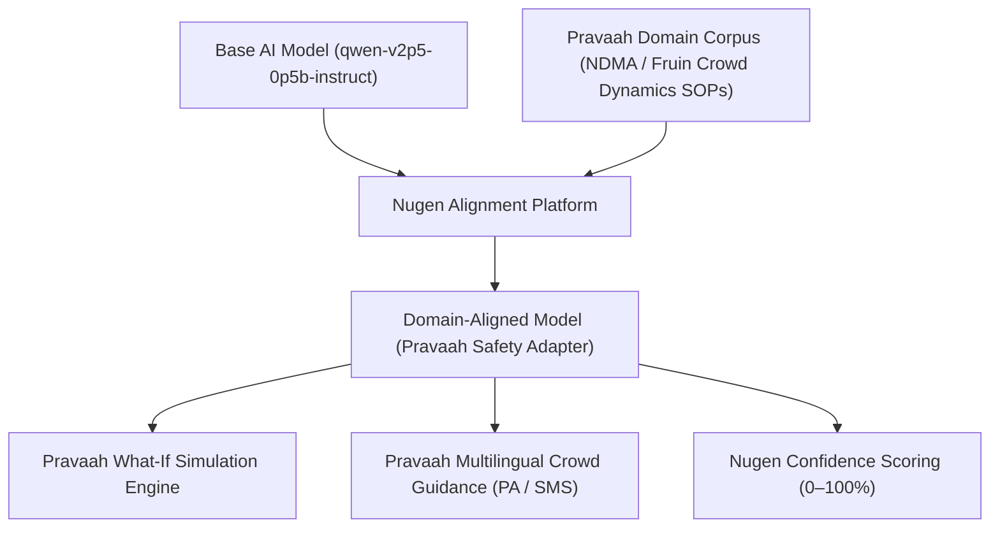

# Pravaah — Nugen Intelligence Domain Alignment Report
**HackCelestial 3.0 | Pillai University**  
**Task:** Additional Task 2 — Mandatory Technology Requirement (Nugen Intelligence)  
**Team / Project:** Pravaah (AI-Driven Mega-Event Crowd Flight Simulator)  

---

## 1. Executive Summary

As mandated by the HackCelestial 3.0 judges, Pravaah integrates **Nugen Intelligence** to solve the domain alignment challenge for mega-event crowd safety. Rather than utilizing a generic foundation model or a basic API wrapper, Pravaah implements the complete end-to-end alignment pipeline:

$$\text{Base AI Model} \longrightarrow \text{Nugen Train-Time Alignment} \longrightarrow \text{Domain Aligned Model} \longrightarrow \text{Pravaah Live System}$$



---

## 2. Domain Problem & Why Generic LLMs Fail

Generic LLMs fail in event operations because:
1. **Hallucination of Safety Numbers**: Generic models attempt to guess crowd density, death tolls, or arrival times, violating safety-critical engineering constraints.
2. **Ignorance of Crowd Safety Thresholds**: Base models lack understanding of Fruin's Level of Service (LoS), Indian NDMA crowd management standards (e.g. 2.0 to 4.5 persons/m² warning and crush thresholds).
3. **Inability to Format Physics Engine Patches**: Generic LLMs struggle with strict JSON schema compliance across English, Hindi, and Marathi when parsing real-world organizer stress queries.

### The Pravaah Core Law:
> **An LLM never produces a number on screen.**  
> The Nugen-aligned model's role is strictly:
> 1. Translating natural language organizer what-if queries into validated JSON scenario parameters (`rain`, `railFailAt`, `showDelayMin`, `gatesLateMin`, `turnoutPct`, `slowLanes`).
> 2. Re-wording crowd advisory announcements behind locked token placeholders `[[0]]`, preserving mathematically certified timings computed by the simulation engine.

---

## 3. The 4-Tier Alignment Pipeline

### Tier 1: Base AI Model
- **Model Selected**: `qwen-v2p5-0p5b-instruct`
- **Characteristics**: Fast, lightweight, instruction-tuned foundation model.

### Tier 2: Domain Corpus (Training Data)
Stored under [`docs/nugen_alignment/`](file:///docs/nugen_alignment/):
- **`pravaah_crowd_safety_sop.md`**:
  - NDMA Crowd Management Guidelines
  - Fruin Level of Service (LoS) density triggers
  - Chokepoint mitigation, gate throttling, and cooling intervals
  - Multilingual psychological crowd calming standards
- **`pravaah_scenario_patching.md`**:
  - Multi-lingual training pairs (English, Hindi, Marathi) for scenario parsing
  - Strict schema boundary definitions and negative out-of-domain examples

### Tier 3: Train-Time Alignment on Nugen
- **API Endpoint**: `POST https://api.nugen.in/api/v3/alignment-projects/create`
- **Execution Script**: [`scripts/nugen_align.py`](file:///scripts/nugen_align.py) / [`scripts/nugen-align.mjs`](file:///scripts/nugen-align.mjs)
- **Output**: Unique Aligned Model ID (`NUGEN_MODEL_ID`) representing the fine-tuned domain adapter.

### Tier 4: Integration into Pravaah
- **Client Module**: [`lib/nugen.ts`](file:///lib/nugen.ts) — handles authenticated inference calls, streaming, and confidence score extraction.
- **Organizer What-If Route**: [`app/api/llm/whatif/route.ts`](file:///app/api/llm/whatif/route.ts) — converts queries to scenario patches.
- **Crowd Guidance Route**: [`app/api/llm/polish/route.ts`](file:///app/api/llm/polish/route.ts) — rewrites PA/SMS messages with locked placeholders.
- **System Status Route**: [`app/api/llm/status/route.ts`](file:///app/api/llm/status/route.ts) — returns live alignment metadata.

---

## 4. Technical Proof: Nugen Confidence Scoring

Nugen aligned models return an exclusive metric: **`confidence_score` (0–100%)**:
- On base/unaligned models, `confidence_score` is `null`.
- On Pravaah's Nugen-aligned model, inference returns the alignment score verifying that the output adheres to the domain corpus.
- The Pravaah UI displays this live to operators:
  ```
  ⚡ Nugen Aligned Model (94% confidence) · numbers by the engine
  ```

---

## 5. Live Verification Guide for Judges

1. **Verify Alignment Configuration**:
   Call the Pravaah AI status endpoint:
   ```bash
   curl http://localhost:3000/api/llm/status
   ```
2. **Inspect Domain Corpus**:
   Check [`docs/nugen_alignment/pravaah_crowd_safety_sop.md`](file:///docs/nugen_alignment/pravaah_crowd_safety_sop.md).
3. **Execute What-If Test**:
   - In Pravaah Console, ask in the input bar:
     *"What if 20% more people come and it rains?"* or in Marathi: *"पाऊस पडला आणि 20% लोक जास्त आले तर काय होईल?"*
   - Observe the Nugen badge and confidence score displayed under the scenario card.
